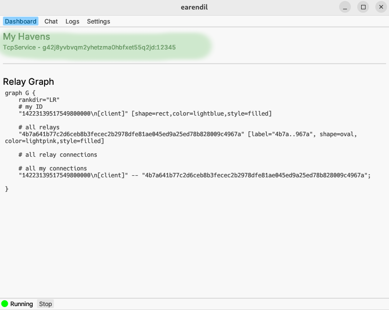

# Visit and host havens

**Havens** are anonymously hosted services, similar to [onion services in Tor](https://community.torproject.org/onion-services/). By hosting a haven, you can serve a TCP service, like a website, IRC server, or similar. Both you and your users will then be protected by Earendil's anonymity guarantees.

This tutorial will teach you how to use and host basic Earendil havens.

## Visit havens

You can access HTTP-based havens right in your browser. Paste the following config file into the "Settings" tab of your Earendil GUI. Be sure to replace "/your/path/` with an appropriate path:

```yaml
state_cache: /your/path/.cache/earendil # where to store persistent information. Must be absolute path
out_routes: # relays to connect to
  example-relay: # arbitrary name for this relay
    connect: 45.33.109.28:12345 # IP and port where the relay is listening
    fingerprint: 4b7a641b77c2d6ceb8b3fecec2b2978dfe81ae045ed9a25ed78b828009c4967a # relay's long-term identity
    obfs: # obfuscation protocol to use
      sosistab3: "randomly-generated-cookie-lala-doodoo" # obfuscation secret, randomly generated by the relay

socks5:
  listen: 127.0.0.1:23456 # localhost port where the proxy server listens
  fallback: pass_through # let all non-Earendil traffic through as if you're not using Earendil. Requests to `google.com` will behave the same way as if you weren't connected to the Earendil proxy.
```

Then, set your browser to use `localhost:23456` as a SOCKS5 proxy. For Firefox this looks like:


Try visiting

  ```!
  http://t90bt94h01ezd75zv9rtzam60thnbkvz.haven:12345
  ```

like you would any ordinary website. You should be greeted with:


You just visited your first Earendil haven! With this setup, you can visit any Earendil haven you know the address to.


All Earendil haven websites are HTTP only, since certificate authorities generally do not issue certificates to `.haven` domains. HTTPS is unnecessary because Earendil traffic is already encrypted.


## Host havens

As an introduction to hosting havens, let's host a website as a haven.

### Start a localhost web server

First, **set up a web server that listens on port 8000**. For our example, we'll use Nginx.

1. Install Nginx if it's not already installed.
2. In the nginx config file (most likely located at `/etc/nginx/nginx.conf`), look for a section that configures a server listening on 8000, and change that to the following:

```
server {
    listen       8000;
    server_name  localhost;

    location / {
      root /usr/share/nginx/html;
      index index.html;
    }
}
```

3. Start your Nginx server. On Linux: `systemctl start nginx`
4. You should now be able to see your server on `localhost:8000`!

### Set up the haven

Paste this config file into your Earendil GUI's "Settings" tab. Be sure to replace "/your/path/` with an appropriate path:

```yaml
state_cache: /your/path/.cache/earendil # where to store persistent information. Must be absolute path

out_routes: # relays to connect to
  example-relay: # arbitrary name for this relay
    connect: 45.33.109.28:12345 # IP and port where the relay is listening
    fingerprint: 4b7a641b77c2d6ceb8b3fecec2b2978dfe81ae045ed9a25ed78b828009c4967a # relay's long-term identity
    obfs: # obfuscation protocol to use
      sosistab3: "randomly-generated-cookie-lala-doodoo" # obfuscation secret, randomly generated by the relay

# havens we're hosting
havens:
  - identity_file: /your/path/identity.secret # replace with a writable path for storing this haven's identity secret
    listen_port: 12345
    rendezvous: 4b7a641b77c2d6ceb8b3fecec2b2978dfe81ae045ed9a25ed78b828009c4967a # relay chosen as our rendezvous point for onion-routing
    handler:
      type: tcp_service
      upstream: 127.0.0.1:8000 # where web server is listening
```

* `identity_file`: a writable path for storing your haven's identity secret
* `rendezvous` is the fingerprint of your chosen _rendezvous relay_. This is a relay node that is responsible for receiving and forwarding all the messages meant for your haven, so that your IP address can be kept private from clients of your haven. All havens must have a rendezvous relay; you can read more about the haven protocol's architecture [here](https://docs.earendil.network/wiki/protocols/haven-protocol). For this example, we’ll use the same test relay that we bootstrapped with throughout this tutorial.
* `handler` specifies how to handle traffic to the haven. Here, we use TCP [port forwarding](https://en.wikipedia.org/wiki/Port\_forwarding) to forward all haven traffic to the web server on port 8000.

Start Earendil, and find your haven's address in the "Dashboard" tab:




In the CLI version, you can get your haven's address with
```shell-session
earendil control havens-info
```

You should see something like:

```
TcpForward - qcmnt2mbchhanm7fzacybswzknbsw3zp:12345
```


In our example, `qcmnt2mbchhanm7fzacybswzknbsw3zp` is your haven's **fingerprint**, and `12345` is its **dock** number (analogous to TCP port number). 

People can now find your haven at `http://<your-haven-fingerprint>.haven:<your-haven-dock>`!
