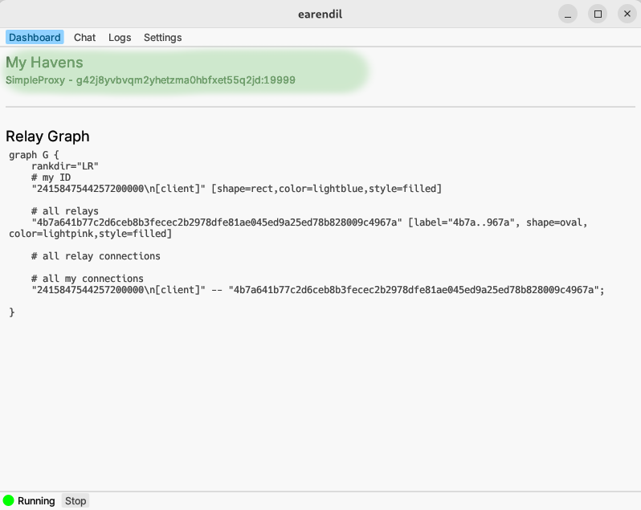

# Host a web proxy

Both client and relay Earendil nodes can host web proxies. When you host an Earendil web proxy, clients that you choose to share the proxy information with can use your node as the exit node to anonymously browse clearnet traffic.



**No access control or filtering**

Currently, there is no support for authenticating proxy users or filtering traffic through the web proxy you host. This means, among other things, that users of your proxy can:

* Access local network resources, including on `localhost`
* Waste your bandwidth indiscriminately
* Send email spam and get your IP address blocked by your ISP

Thus, it's currently **not** recommended to set up public web proxies through Earendil unless you are sure of what you're doing.\
\
In the future, we will add support for user authentication and traffic filtering, which will make running a public `simple_proxy` service much more viable.


To host a web proxy, paste this config file into the "Settings" tab of your Earendil GUI:

```yaml
out_routes:
  example-relay-free:
    connect: 62.210.93.59:12345
    fingerprint: 4b7a641b77c2d6ceb8b3fecec2b2978dfe81ae045ed9a25ed78b828009c4967a
    obfs:
      sosistab3: "randomly-generated-cookie-lala-doodoo"
    price_config:
      inbound_price: 0
      inbound_debt_limit: 0
      outbound_max_price: 0
      outbound_min_debt_limit: 0

havens: # havens we're hosting
  - identity_file: /your/path/identity.secret # replace with a writable path for storing identity secret
    listen_port: 19999 # port where proxy server listens
    rendezvous: 4b7a641b77c2d6ceb8b3fecec2b2978dfe81ae045ed9a25ed78b828009c4967a # relay chosen as our rendezvous point for onion-routing
    handler:
      type: simple_proxy # Earendil's web proxy protocol
```

Note that hosting a web proxy necessarily exposes your IP address: a client can always connect to your proxy and go to an IP-checking website.

Since web-proxies cannot have any anonymity, it's not important which rendezvous relay you choose (`rendezvous` field). We recommend choosing yourself (if you're a relay) or an immediate neighbor (if you're a client) as the rendezvous point for optimal performance. In this example, we continue to use the public relay we use in all the tutorials.

Start Earendil, and you can find your new web proxy's information in the "Dashboard" tab:



Now any Earendil node with this information can use the web proxy you just set up to browse the internet anonymously, by including this block in their Earendil config file:

```yaml
socks5:
  listen: 127.0.0.1:23456
  fallback:
    simple_proxy:
      remote: <your-haven-fingerprint>:19999
```
