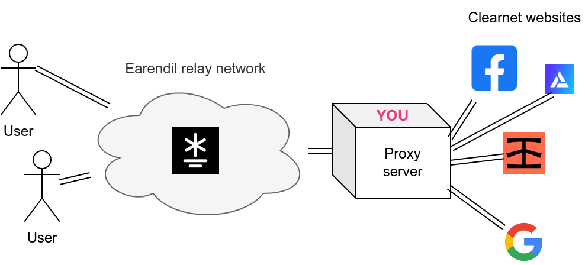

# Host a web proxy

Both client and relay Earendil nodes can host web proxies. When you host an Earendil web proxy, clients that you choose to share the proxy information with can use your node as the exit node to anonymously browse clearnet traffic.



To host a web proxy, paste this config file into the "Settings" tab of your Earendil GUI:

```yaml
out_routes:
  example-relay-free:
    connect: 62.210.93.59:12345
    fingerprint: 4b7a641b77c2d6ceb8b3fecec2b2978dfe81ae045ed9a25ed78b828009c4967a
    obfs:
      sosistab3: "randomly-generated-cookie-lala-doodoo"
    price_config:
      inbound_price: 0
      inbound_debt_limit: 0
      outbound_max_price: 0
      outbound_min_debt_limit: 0

exit_config: # you want to be an exit node
  allowed_ports: # destination ports that your exit node will allow; to only allow browsing http and https websites through your proxy, only put 80 and 443 here
    - 80
    - 443
```

Note that hosting a web proxy necessarily exposes your IP address: a client can always connect to your proxy and go to an IP-checking website.

Start Earendil. Now clients will be able to automatically use your node as their web proxy!
