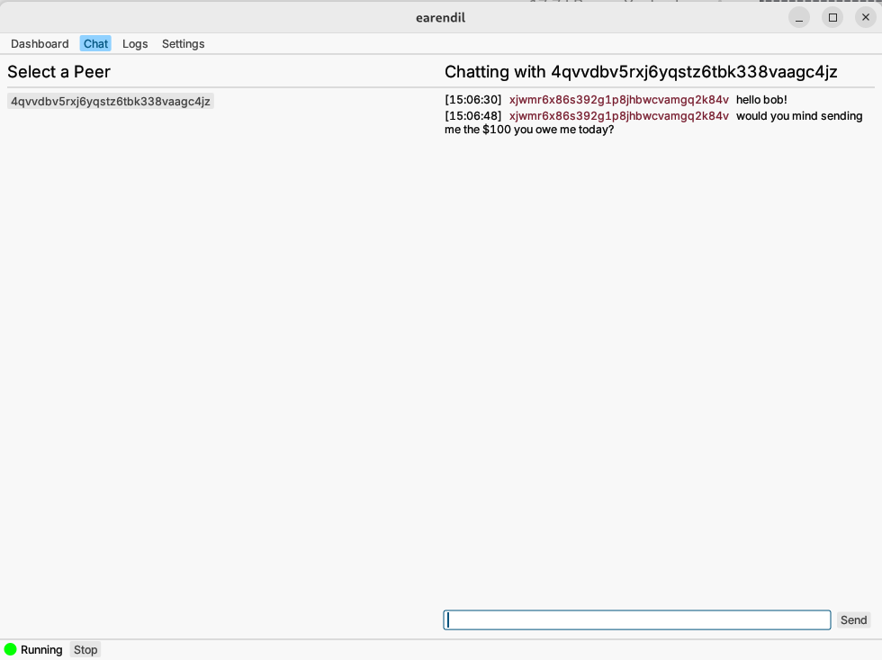

# `link-chat`

Earendil's `link-chat` is a minimal chat tool for talking to your immediate neighbors in the Earendil network. You can use it to negotiate connection prices and discuss your debts with your neighbors.

## GUI
`link-chat` is located in the "Chat" tab of the Earendil GUI. You can chat with any of your direct neighbors by selecting their fingerprint in the menu on the left side of the screen:



## CLI
To use `link-chat` on the command line, type in a terminal:

```!bash
earendil control [--connect 127.0.0.1:control_listen_port] chat <COMMAND>
```

where `<COMMAND>` is one of:
- `list` - prints a summary of all your conversations
- `start <neighbor-prefix>` - starts an interactive chat session with a neighbor whose fingerprint starts with `<neighbor-prefix>`. This will fail if `<neighbor-prefix>` matches more than one neighbor (in that case, use a longer prefix).

Some examples:

```!bash
$ earendil control chat start zpy
<starting chat with zpyzw3hpax9fnwww08h9bhr866qvh6wn>
<- hey alice! [2024-01-10 19:59:55]
-> hey bob! [2024-01-10 19:59:58]
<- how's the weather? [2024-01-10 20:00:04]
sunny!
-> sunny! [2024-01-10 20:01:15]

```

```!bash
$ earendil control chat list
+------------------------------------+-------------------+-----------------------------------+
| Neighbor                           | # of Messages     | Last chat                         |
+------------------------------------+-------------------+-----------------------------------+
| 4b7a641b77c2d6ceb8b3fecec2b2978... | 4                 | sunny! [2024-01-10 15:29:05]
+------------------------------------+-------------------+-----------------------------------+
```

