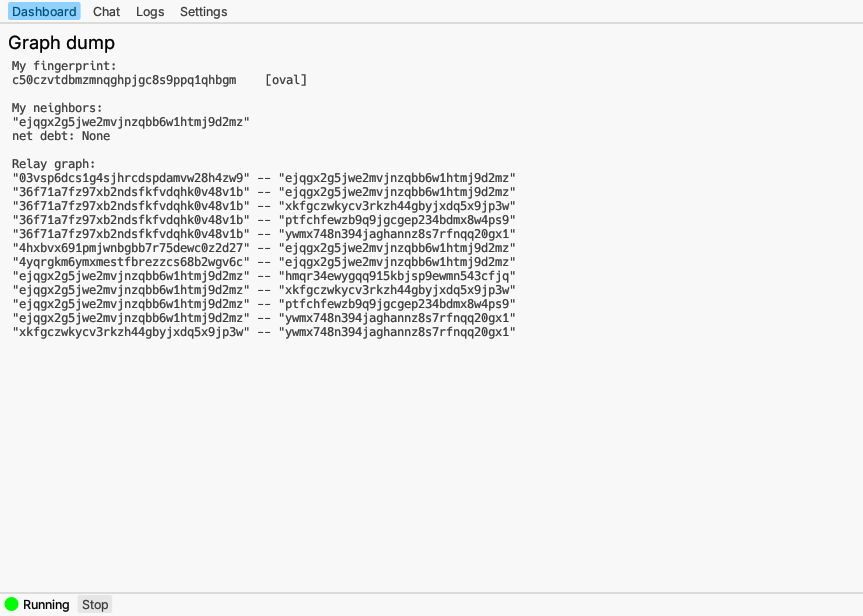

`earendil` is the reference implementation of Earendil, running as a background daemon similar to how tor runs as Tor's daemon. 

This tutorial will teach you how to use the `earendil` executable: in particular, how to configure and run both **client** and **relay** nodes.
- **Relays** form the backbone of the Earendil network. They serve other nodes on the network by relaying messages for them.
- **Clients** do not relay any traffic, and they access the network with the help of relays. They cannot be neighbors with other clients.

You can read more about Earendil's architecture in the wiki's [Network architecture](../wiki/architecture.md) section. This tutorial will also give you the necessary background to [host havens](./using-havens.md) and [proxy normal Internet traffic through Earendil](./browsing-web.md).

### The config file
All of `earendil`'s configuration options are specified in a `yaml` config file. The `earendil` daemon takes in this config file when it first starts. Here's an example config file:

```yaml
db_path: ./.cache/earendil

identity_file: /your/path/identity.secret

control_listen: 127.0.0.1:11111

out_routes:
  example-relay:
    connect: 45.33.109.28:12345 
    fingerprint: 4b7a641b77c2d6ceb8b3fecec2b2978dfe81ae045ed9a25ed78b828009c4967a 
    obfs:
      sosistab3: shove-mistake-wish-endless-antique-citizen-filter-employ-cigar-clip-acid-defense
  relay-2: 
    connect: ...
    fingerprint: ...
    obfs: none
in_routes:
  main_obfs:
    obfs: 
      sosistab3: snake-before-antenna-toward-floor-stuff-frozen-power-avocado-retire-grunt-nation
    listen: 0.0.0.0:19999
```

Here's what each field of the config file means:
- `db_path`: **[optional]** path to file for storing information that's persisted across reboots of `earendil` daemon. Such information includes the global relay graph and chat history --- storing it will speed up connection time when the daemon first starts up and preserve chat history. This must be a path writable by the `earendil` daemon. Omit this key if you don't care about persisting any information.
- `identity_file`: **[include for relays, omit for clients? TODO]** path to file for storing a long-term identity.
- `control_listen`: **[optional]** IP address where the daemon listens for [control commands](TODO: link to control commands section). Currently sending control commands to remote daemons is not supported, so this should be `127.0.0.1:<free port>`. If you do not specify this key, then the daemon listens for control commands on a default port. This means that if you start more than one `earendil` daemon on the same machine, you must specify this field in all but one of the daemon configs in order to prevent the additional daemons from trying to listen on the same port and crashing.
- `out_routes`: relays to connect to as neighbors. Configs for client nodes must contain at least one `out_route`; `out_routes` are optional for relays. For each `out_route`:
  - `connect`: IP address and port where the relay is listening for incoming connections
  - `fingerprint`: long-term identity of the relay
  - `obfs`: There are currently 2 obfuscation options:
    - `none`: no obfuscation. In a censored network environment, this may lead to your connection to this relay getting blocked.
    - `sosistab3`: a TCP-based obfuscated transport with a symmetric cookie, defined by the relay. This obfuscation protocol is developed as a part of [geph5](https://github.com/geph-official/geph5) and currently being tested in production in some of the world's most hostile internet environments.
- `in_routes`: **[only for relays]** 

### `earendil daemon`

### `earendil control`
### Run a client node

1. Save this config file:

```yaml
db_path: ./.cache/earendil # where to store persistent information
# relays to connect to
out_routes:
  example-relay: # arbitrary name for this relay
    connect: 45.33.109.28:12345 # IP and port where the relay is listening
    fingerprint: 4b7a641b77c2d6ceb8b3fecec2b2978dfe81ae045ed9a25ed78b828009c4967a # relay's long-term identity
    obfs: # obfuscation protocol to use
      sosistab3: "randomly-generated-cookie-lala-doodoo" 
```

- If you're using the **CLI** version: save it into a file named `config.yaml`
- If you're using the **GUI**: paste it into the "Settings" tab

  

2. Run `earendil` with this config:
  - **CLI**: 
    ```bash
    earendil daemon --config config.yaml
    ```
  - **GUI**: clicking the "Start" button in the bottom tray

You should see logs output like this:

```shell-session
2024-04-03 13:09:23.568700564 -04:00, INFO, earendil::daemon, message = starting background task for main_daemon; 
2024-04-03 13:09:23.569111506 -04:00, DEBUG, earendil::context, message = INITIALIZING GLOBAL IDENTITY; 
2024-04-03 13:09:23.569170173 -04:00, DEBUG, earendil::context, message = BLOCKING ON DB; 
2024-04-03 13:09:23.569190287 -04:00, DEBUG, earendil::db, message = INITIALIZING DATABASE; 
2024-04-03 13:09:23.569198388 -04:00, DEBUG, earendil::context, message = **** INIT RELAY GRAPH****; 
2024-04-03 13:09:23.904955042 -04:00, DEBUG, earendil::daemon::inout_route, message = SOSISTAB connected to other side; 
2024-04-03 13:09:23.906228588 -04:00, DEBUG, earendil::daemon::inout_route, message = link connected to other side; 
2024-04-03 13:09:23.908024752 -04:00, DEBUG, earendil::daemon::chat, message = initializing chats; 
```


GUI: go to the "logs" tab in the top bar to see the logs!





Currently, `sosistab3` (an obfuscated TCP transport) and `none` (no obfuscation) are the only supported transport protocols in Earendil.



**Obtaining relay information safely**

In the configuration above, we added a _publicly available_ example relay that the Mel team maintains.

It is important to note that in production, _Earendil relay information will not generally be publicly available_. You will need to personally know a relay operator to obtain contact information out-of-band, through chat, email, or offline.

This is to ensure **ban-resistance**: if any client can just request relay information, attackers can simply join the network to get a list of relays, which can let them block or identify Earendil traffic.

Thus, if you want to actually ensure ban-resistance, don't use the relay we gave you above! Instead, you can come to [our Discord](https://discord.gg/jdVuk4Qj89) to ask other users for help.


Congratulations! You've successfully started an Earendil client node.

### Run a relay node

We currently only support running relays with the CLI version.
1. Save this config file into a file named `relay-cfg.yaml`:

```yaml
# Earendil relay config file
db_path: ./.cache/earendil # where to store persistent information

# relay settings
identity_file: /your/path/identity.secret # replace with a writable path for storing identity secret

in_routes:
  main_udp:
    obfs: 
      sosistab3: <your_random_seed> # random seed for obfsudp cookie. Generate your own with "earendil generate-seed"
    listen: 0.0.0.0:19999 # port where this in-route listens

# neighbors, same as in the client config
out_routes:
  example-relay: 
    connect: 45.33.109.28:12345 
    fingerprint: 4b7a641b77c2d6ceb8b3fecec2b2978dfe81ae045ed9a25ed78b828009c4967a  
    obfs:
      sosistab3: "randomly-generated-cookie-lala-doodoo" 

```

2. Start the `earendil` daemon using this relay config:

```
earendil daemon --config relay-cfg.yaml
```

3. While the `earendil` daemon is running, obtain your relay's contact information for other nodes to connect with you as a neighbor with the control command `my-routes`:

```shell-session
earendil control my-routes
```

The output should look like:

```yaml
main_udp:
  connect: <YOUR_IP>:19999
  fingerprint: 57a407e50c1f4d0cdfb16332f6a836b27cc3409941fa26d85bc2b1eca604e536
  obfs:
    sosistab3: <your_random_seed>
```

Replace `<YOUR_IP>` with your server's public IP address. Other nodes (both clients and relays) can simply paste this block into the `out_routes` section of their config file to add your relay as a neighbor.

To serve users in regions with internet censorship, you should _avoid_ posting your relay's contact information publicly. Instead, distribute it in a way that reaches legitimate users but not censors--your relay will be blacklisted if the censor learns its IP address.

## Config file

Here are a few more handy things to know about the config file.

### Relay vs client?

The defining difference between relay configs and client configs is: relay configs have an `in-routes` section that specifies where and how to accept incoming connections, while client configs do not. So config files that have an `in-routes` section are relay configs, and ones that do not are client configs.

### Adding more neighbors

Here is the example client config file from above:

```yaml
db_path: ./.cache/earendil # where to store persistent information
# relays to connect to
out_routes:
  example-relay: 
    connect: 45.33.109.28:12345 
    fingerprint: 4b7a641b77c2d6ceb8b3fecec2b2978dfe81ae045ed9a25ed78b828009c4967a 
    obfs: 
      sosistab3: "randomly-generated-cookie-lala-doodoo" 
```

With a config file like this, our node only connects to one neighbor. To add a second neighbor, we simply put another relay information block under the `out_routes` section:

```yaml
db_path: ./.cache/earendil # where to store persistent information
# relays to connect to
out_routes:
  example-relay: 
    connect: 45.33.109.28:12345 
    fingerprint: 4b7a641b77c2d6ceb8b3fecec2b2978dfe81ae045ed9a25ed78b828009c4967a 
    obfs: 
      sosistab3: "randomly-generated-cookie-lala-doodoo" 
  relay-2:
    connect: ...
    fingerprint: ...
    obfs: ...
```

### `identity_file`

Here's the example relay config file from above:

```yaml
# Earendil relay config file
db_path: ./.cache/earendil # where to store persistent information

# relay settings
identity_file: /your/path/identity.secret # replace with a writable path for storing identity secret

in_routes:
  main_udp:
    obfs: 
      sosistab3: <your_random_seed> # random seed for obfsudp cookie. Generate your own with "earendil generate-seed"
    listen: 0.0.0.0:19999 # port where this in-route listens

# neighbors, same as in the client config
out_routes:
  example-relay: 
    connect: 45.33.109.28:12345 
    fingerprint: 4b7a641b77c2d6ceb8b3fecec2b2978dfe81ae045ed9a25ed78b828009c4967a  
    obfs:
      sosistab3: "randomly-generated-cookie-lala-doodoo" 
```

`identity_file` is an optional file path for storing a persistent Earendil identity. When this field is not specified, a random identity is generated every time `earendil` restarts.

* **Relays** must specify `identity_file` in their config files, as they need to maintain a persistent identity for clients to connect to.
* **Clients** do not need to specify `identity_file`, since they have no long-term identity on the Earendil network.

## 1+ nodes on 1 machine

You can interact with a running `earendil` daemon with `earendil control` commands. Check the list of `control` commands with:

```bash
earendil control
```

```
Runs a control-protocol verb

Usage: earendil control [OPTIONS] <COMMAND>

Commands:
  havens-info        Prints the information of all hosted havens
  global-rpc         Send a GlobalRpc request to a destination
  insert-rendezvous  Insert a rendezvous haven locator into the dht
  get-rendezvous     Looks up a rendezvous haven locator
  relay-graphviz     Dumps the relay graph in graphviz format
  my-routes          Dumps my own routes
  chat               Interactive chat for talking to immediate neighbors
  help               Print this message or the help of the given subcommand(s)

Options:
  -c, --connect <CONNECT>  [default: 127.0.0.1:18964]
  -h, --help               Print help

```

To run multiple Earendil nodes on the same machine, we need to override the default port where the daemon listens for `control` commands for the additional nodes, by putting a `control_listen` section in their config files:

```yaml
control_listen: 127.0.0.1:11111
identity_file: ...
out_routes: ...
```

Say we put the above in `bob-cfg.yaml`; to send `control` commands to bob, we now need to add the flag `--connect 127.0.0.1:11111`. For example:

```
earendil control --connect 127.0.0.1:11111 my-routes
```

Be sure to use a different port for each additional node!

## Inspecting the relay graph


GUI: start your node, then go to the "Dashboard" tab to see the relay graph!





Now that you're connected to the network, you can inspect the graph of Earendil relays from your node's perspective using:

<pre><code><strong>earendil control graph-dump
</strong></code></pre>

This produces Graphviz code that looks like:

```
digraph G {
    subgraph cluster_0 {
        color=lightblue;
        label="myself       [relay]";
        node [shape=Mdiamond,color=lightblue,style=filled];
        "7vcnrhf8dhjfyyc4djn255sbe3jj3g6r"
    }
    subgraph cluster_1 {
        color=lightpink
        label="my neighbors";
        node [color=lightpink,style=filled]
        "xh6tsvafwbgd2wc9akckc8pdwbv4arqw"
    }
    "7vcnrhf8dhjfyyc4djn255sbe3jj3g6r" [label="7vcn..3g6r"]
    "xh6tsvafwbgd2wc9akckc8pdwbv4arqw" [label="xh6t..arqw"]
    "bk6c3s76dzs8exna5vpcxwy92p49v0qt" [label="bk6c..v0qt"]
    "wbnm5bhq7hr6jwgnjqtd50zryebccq43" [label="wbnm..cq43"]

    "7vcnrhf8dhjfyyc4djn255sbe3jj3g6r" -> "xh6tsvafwbgd2wc9akckc8pdwbv4arqw";
    "bk6c3s76dzs8exna5vpcxwy92p49v0qt" -> "wbnm5bhq7hr6jwgnjqtd50zryebccq43";
    "wbnm5bhq7hr6jwgnjqtd50zryebccq43" -> "xh6tsvafwbgd2wc9akckc8pdwbv4arqw";
}
```

Paste the output into a [Graphviz renderer](https://dreampuf.github.io/GraphvizOnline/) to visualize the graph:

<figure><figcaption></figcaption></figure>

You are the blue node, your immediate neighbors are pink, and all the other relays are in white. Since only information about relays is gossiped to the entire network, no clients other than yourself (if you're a client node) can appear in this graph.

`graph-dump` also has a human readable mode:

<pre class="language-bash"><code class="lang-bash"><strong>earendil control graph-dump -h
</strong>My fingerprint:
7vcnrhf8dhjfyyc4djn255sbe3jj3g6r    [relay]

My neighbors:
"xh6tsvafwbgd2wc9akckc8pdwbv4arqw"

Relay graph:
"7vcnrhf8dhjfyyc4djn255sbe3jj3g6r" -- "xh6tsvafwbgd2wc9akckc8pdwbv4arqw"
"bk6c3s76dzs8exna5vpcxwy92p49v0qt" -- "wbnm5bhq7hr6jwgnjqtd50zryebccq43"
"wbnm5bhq7hr6jwgnjqtd50zryebccq43" -- "xh6tsvafwbgd2wc9akckc8pdwbv4arqw"
</code></pre>

Learning about other nodes on the network takes time, so your node will not know the complete relay graph when it first starts. Depending on how many relays are in the network, you may have to wait a couple minutes to several hours for the graph to stabilize.

## Next up

Now you know how to run basic client and relay nodes, plus how to inspect the relay graph! The next two tutorials will teach you the two most fundamental features of Earendil:

* Visting and hosting Earendil [**havens**](./using-havens.md): Internet services (like websites) hosted anonymously on the Earendil network
* Using the Internet anonymously by proxying it through an Earendil-based [**web-proxy**](./browsing-web.md).
