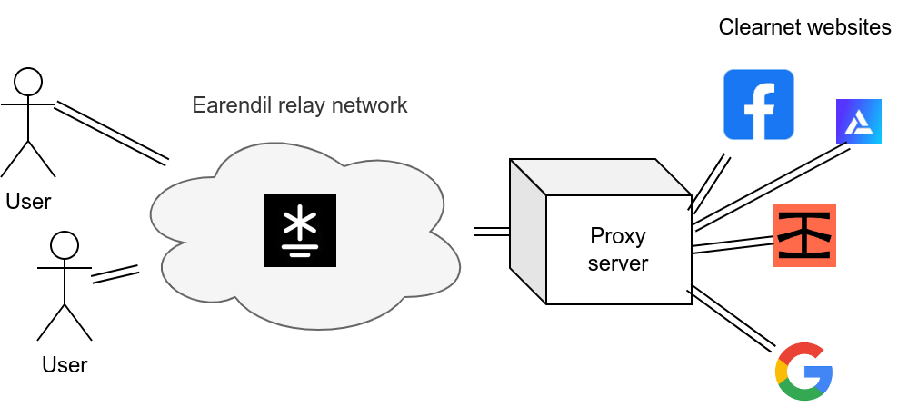
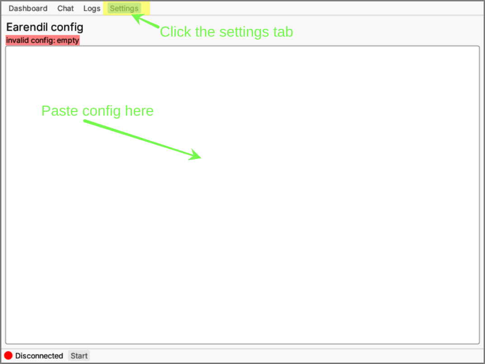
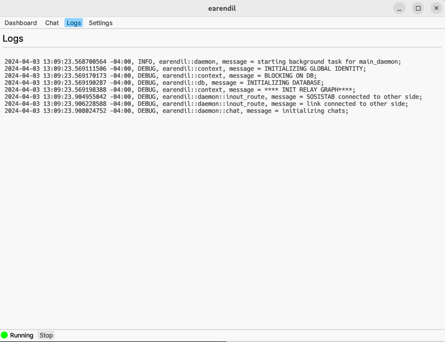

# Quick start

<figure><figcaption><p>Proxying Web traffic over Earendil</p></figcaption></figure>

In this tutorial, we'll show you how to proxy web traffic through the Earendil network using the `earendil` GUI.

If you haven't already, **install the GUI** from the [Installation](./installation.md) section.

## Configure + start Earendil

All of `earendil`'s configuration options are specified in a YAML config file, located in the "Settings" tab of the GUI.



Paste this config file into your Settings tab. Be sure to replace "/your/path/` with an appropriate path:

```yaml
state_cache: /your/path/.cache/earendil # where to store persistent information. Must be absolute path

out_routes: # relays to connect to
  example-relay: # arbitrary name for this relay
    connect: 45.33.109.28:12345 # IP and port where the relay is listening
    fingerprint: 4b7a641b77c2d6ceb8b3fecec2b2978dfe81ae045ed9a25ed78b828009c4967a # relay's long-term identity
    obfs: # obfuscation protocol to use
      sosistab3: "randomly-generated-cookie-lala-doodoo" # obfuscation secret, generated and provided by the relay

socks5:
  listen: 127.0.0.1:23456 # localhost port where the proxy server listens
  fallback:
    simple_proxy: # proxy server for all clearnet traffic
      remote: v5k6rydpg9yh9hft6c7qwz9sm3z99ytt:23456
```

The `socks5` block in the config file exposes a Socks5 proxy server on `localhost:23456` that will proxy traffic through Earendil.

Now, start the daemon by pressing "Start" in the bottom tray. Go to the "Logs" tab, and you should see `earendil`'s logs appearing.



You're all connected on the Earendil side!

## Connect your browser

To browse the web through Earendil, we need to configure a web browser to use our Earendil SOCKS5 proxy (at `localhost:23456`). For Firefox this looks like:


Visit any website as you normally would, except now all your traffic is going through Earendil! You can confirm this by [checking](https://bgp.he.net/) your IP address: you're properly connected if it's `45.33.109.28`. That's the IP address of this tutorial's bootstrap node.

Now you can use Earendil as a web proxy to browse the internet anonymously! Feel free to share [speed tests](https://speed.cloudflare.com/) in our [Discord](https://discord.gg/AVsGbhzTzx).


**Obtaining relay information safely**

In the configuration above, we added a _publicly available_ example relay that the Mel team maintains.

It is important to note that in production, _Earendil relay information will not generally be publicly available_. You will need to personally know a relay operator to obtain contact information out-of-band, through chat, email, or offline.

This is to ensure **ban-resistance**: if any client can just request relay information, attackers can simply join the network to get a list of relays, which can let them block or identify Earendil traffic.

Thus, if you want to actually ensure ban-resistance, don't use the relay we gave you above! Instead, you can come to [our Discord](https://discord.gg/jdVuk4Qj89) to ask other users for help.

