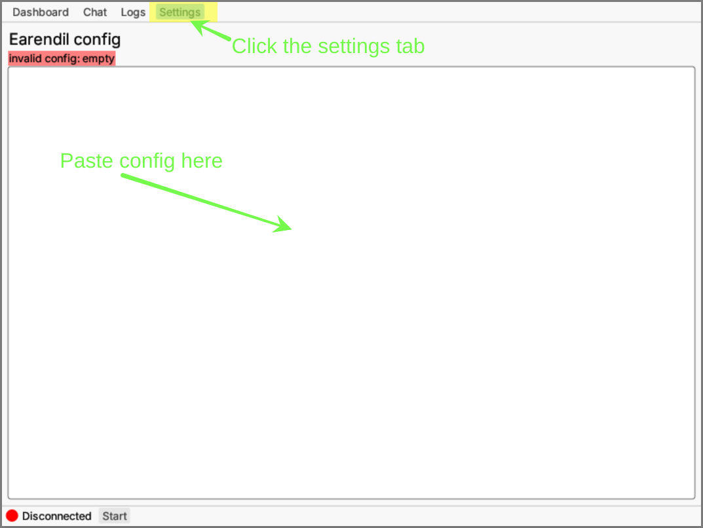

# GUI

## Windows and Mac

To get started with the Earendil GUI app, you'll first want to download the latest executable for your platform from our [Releases page](https://github.com/mel-project/earendil/releases).

Once your download is complete, head to your computer's download folder to locate the file. You'll need to unzip or decompress it first. On Windows, you can do this by right-clicking the file and selecting "Extract All...", while on macOS, you usually just need to double-click the file.

With the file decompressed, you're almost ready to run your program. Locate the executable file in your download folder or within the decompressed files. You can now start the program simply by double-clicking on the executable file.

Please keep in mind that the binary you download must be compatible with your operating system. If the file doesn't run as expected, it's possible you downloaded the wrong version.

## Linux

You can use `cargo` to download, build, and launch the GUI:

1. `$ git clone https://github.com/mel-project/earendil` to get the latest source code on the `master` branch
2. Use `$ cd`` ``utilities/earendil-gui` to move into the `earendil-gui`directory
3. Install it with `$ cargo install --path .`
4. Finally, launch it with `$ earendil-gui` !

## Usage

After launching the GUI, you should see the default "Dashboard" tab:

<figure><figcaption>
Earendil GUI Dashboard
</figcaption></figure>

As you can see, there is currently no information available in our graph dump. This is because our node is disconnected. In order to start it up, let go over to the "Settings" tab.

<figure><figcaption>
Earendil GUI Settings with empty config
</figcaption></figure>

From here we can paste the example configuration from the [quick start instructions](../quick-start-1.md#config-file). If our config file is correct we will see "config successfully validated!" in green.

<figure><figcaption>
Earendil GUI Settings with validated config
</figcaption></figure>

Now that we have configured our node, we can start it by clicking the "Start" button in the tray at the bottom of the screen. Once we've started our node, we can head over to the "Logs" tab to see the node's current activity and state.

<figure><figcaption>
Earendil GUI Logs
</figcaption></figure>

We can also check the "Dashboard" tab again to see information about our identity, our neighbors, and the overall relay graph of the network.

<figure><figcaption>
Earendil GUI Dashboard with information
</figcaption></figure>

Finally, we can head over to the "Chat" tab to start chatting with any of our direct neighbors by clicking on the button with their fingerprint.

<figure><figcaption>
Earendil GUI Chat
</figcaption></figure>

Write a message and send!

<figure><figcaption>
Earendil GUI Chat settlement
</figcaption></figure>

Follow the [quick start](../quick-start-1.md) tutorial to learn more about config files, hosting havens, and browsing the web over the Earendil network!
