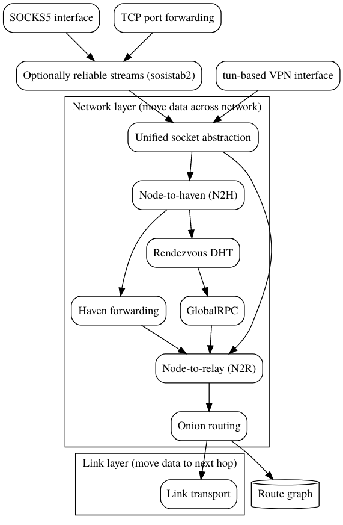

# Protocols

Earendil presents a pretty simple interface (basically a virtual IPv6-like network device with some convenience methods), but under the hood is many layers of protocols.

This is illustrated by the following picture. **Note that A->B means A **_**depends**_** on B**, not that A somehow sends data unidirectionally to B!

