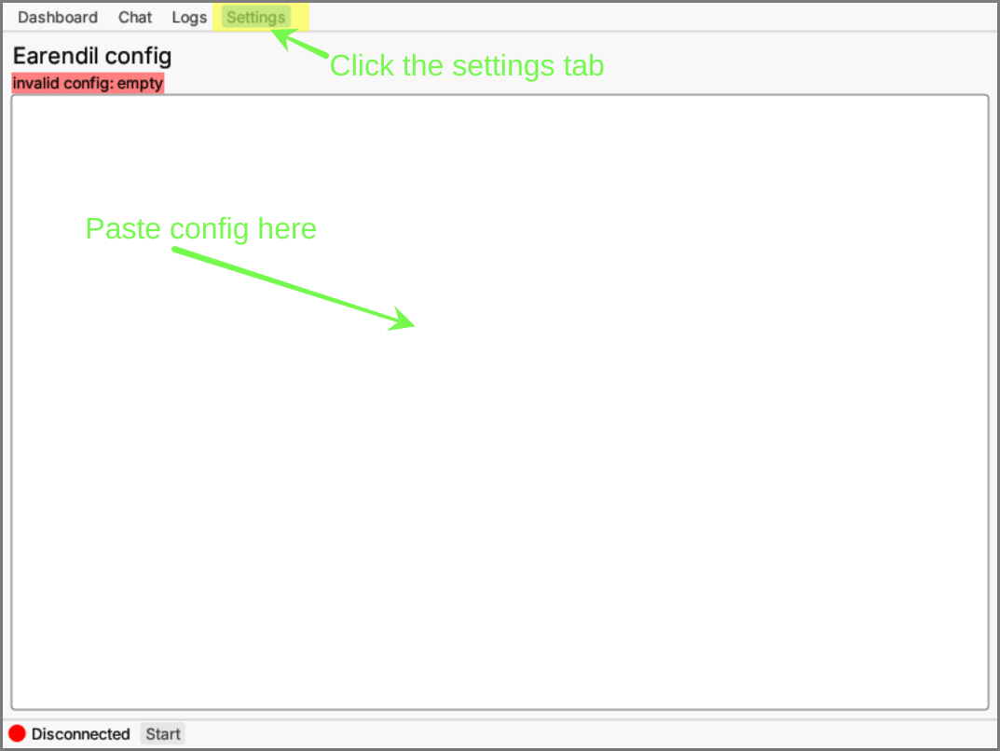

# 简介


目前，Earendil 仍处于 **Pre-alpha（预阿尔法）** 阶段，不少功能尚未准备就绪。一些文档页面描述的是尚处于开发中、未发布的功能。


[**Earendil**](https://earendil.network) 是一个去中心化的、抗审查的、奖励兼容的通信和价值传输网络。即使面对强大的国家级攻击者，Earendil 网络的任意两个用户仍然可以自由地通讯和交易，

<figure><figcaption></figcaption></figure>

更简单地说，Earendil 是一个**魔法互联网虫洞**：字节和金钱从一端输入，从另一端输出，没有人能叫停。

使用 Earendil 可以：

- 构建反封锁、保护匿名的应用和 P2P 网络
- 匿名浏览普通互联网网站，隐藏你的地理位置
- 通过运行 Earendil 基础设施节点来赚取费用
- 非常低成本地发送基于 Mel 的加密货币

## 为什么选择 Earendil？

乍一看，Earendil 似乎与现有的分布式洋葱路由或混淆网络（如 I2P 或 Nym） 类似。但它有几个特别独特的功能（[这篇中文博文](https://nullchinchilla.me/2023/11/qian-tan-earendil/)中有更多解释）：

### 强大的抗封锁能力

Earendil 抵抗[甲类](https://nullchinchilla.me/2023/05/two-kinds-of-censorship-resistance/)审查（在网络内过滤内容或用户，或称作**过滤**）又抵抗[乙类](https://nullchinchilla.me/2023/05/two-kinds-of-censorship-resistance/)审查（完全阻止访问 Earendil，或称作**封禁**）。

在其他项目中，抗封禁能力非常罕见。即使存在，也通常局限于针对国家级防火墙（如中国的长城防火墙）的特殊防御手段（例如 Tor 的混淆桥接）。

与此不同，Earendil 的设计目的是：**即使是 GFW（长城防火墙）在全球范围内部署**也能够运作。它不假设大部分网络存在于「自由世界」中。这基于两个重要的设计原则：

- **点对点混淆**：默认情况下，Earendil 流量使用先进的混淆协议，使它难以与「正常」网络流量区分开来。此外，用于任何特定的节点间链接的协议可以更换，使用类似于 Tor 桥接的「可插拔传输」架构，适应特别严峻的网络环境（例如，只允许明文 HTTP 和中间人攻击的 HTTPS 流量的网络）
- **邀请制路由**：Earendil 利用独特的、纯邀请制的[“朋友对朋友”架构](wiki/architecture.md)路由流量，不会向每个节点透露整个网络的信息，这使得即使是强大的攻击者也难以编制起 Earendil 节点的有用清单，用于监控或审查。

### 简单、自由的点对点激励机制

Earendil **可选地**允许每个节点设置其对等点必须支付的资源消耗价格，通过使用 MEL 结算的加密货币进行微支付（micropayments）。

微支付巧妙地解决了抗女巫攻击（防止恶意节点淹没网络）、诚实节点的激励，以及抵抗拒绝服务攻击（DoS）。行为不端的节点将不会被他们的对等点支付，而诚实节点被激励在自由市场中竞争，以向客户提供最好的服务。企图刷屏 Earendil 的恶意行为者必须相应地支付网络费用。

这比其他激励/抗女巫攻击的机制有重要优势，例如用户基于向智能合约支付费用，而服务商向其证明对网络做出的贡献以取款的「统购统销」模型。在这篇[博文](https://nullchinchilla.me/2023/07/earendil-incentives/)中有进一步的解释。

### 可调匿名性/性能折中

像 Tor 和 Nym 一样，Earendil 消息利用洋葱加密来保护用户流量的匿名性和隐私。

但与这些其他系统不同的是，Earendil 不只是一个保护隐私的工具。**用户可以自由地在匿名性和性能之间进行权衡**。

通过选择不同的路由选择算法和混合网络延迟分布，Earendil 可以用作以下场景：

- 类似 `ngrok` 的 NAT 穿透工具，具有强大的抗封锁网络，适用于 VPN 和电话通话等；
- 类似 Tor 的低延迟洋葱路由网络，适用于安全性较低的暗网网站等；
- 类似 Nym 或甚至更慢的高延迟混淆网络，适用于高度匿名通信。

## 开发状态与路线图

目前，Earendil 处于 **Pre-alpha（预阿尔法）** 阶段。你可以加入 Earendil 网络并在其上通信，但一些重要功能还原始或不完整：

| 功能                        | 完成状态                           | 备注                                                                          |
| --------------------------- | ---------------------------------- | ----------------------------------------------------------------------------- |
| 加入作为中继节点            | :white_check_mark: 已完成          |                                                                               |
| 加入作为客户端              | :white_check_mark: 已完成          |                                                                               |
| 洋葱路由                    | 🚧 初步实现                        | _无法自定义或随机路由选择。仅支持最短路径。_                                  |
| 避风港（匿名托管）          | :white_check_mark:                 |                                                                               |
| 网页代理                    | 🚧 初步实现                        | _托管网页代理，帮助其他用户通过 Earendil 「翻墙」。_                          |
| 债务计算                    | ❌ 未实现（计划于 **0.2.x** 版本） | _计算对邻居资源的应支付金额。_                                                |
| 手动债务结算                | ❌ 未实现（计划于 **0.2.x** 版本） | _线下结算债务，并在协议中手动重置。_                                          |
| 混淆网络（mixnet）延迟      | ❌ 未实现（计划于 **0.3.x** 版本） | _延迟消息以抵御规模化攻击者，保护匿名性。_                                    |
| 自动债务结算（链上）        | ❌ 未实现（计划于 **0.3.x** 版本） | _使用链上转账自动结算以 MEL 计价的债务。_                                     |
| 以 Mel 为后盾的女巫攻击抵抗 | ❌ 未实现（计划于 **0.4.x** 版本） | _通过要求在 Mel 区块链上抵押资产来限制中继的数量。_                           |
| 链下自动债务结算系统        | ❌ 未实现（计划于 **0.4.x** 版本） | _使用匿名支付通道（anonymous payment channels）。Earendil 实现链下支付功能。_ |
