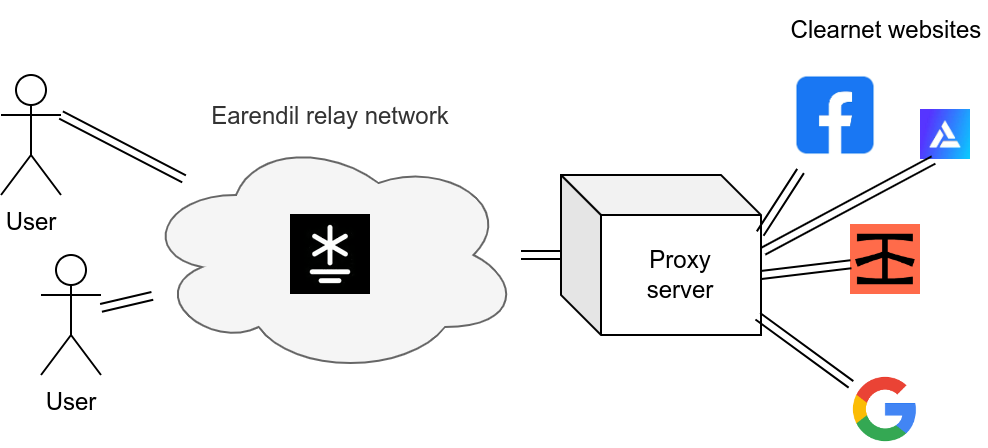

# 快速入门

<figure><figcaption><p>通过 Earendil 代理网络流量</p></figcaption></figure>

在本教程中，我们将展示如何使用 `earendil` 的图形界面（GUI）通过 Earendil 代理网络流量。

如果您尚未安装 GUI，请从[安装部分](./ru-he-an-zhuang.md)进行安装。

## 配置并启动 Earendil

所有的 `earendil` 配置选项都在一个 YAML 格式的配置文件中指定，该文件位于 GUI 的 “Settings” 标签中。


将此配置文件粘贴到您的设置标签中。请确保将 "/your/path/" 替换为适当的路径：

```yaml
state_cache: /your/path/.cache/earendil # 存储持久信息的位置。必须是绝对路径

out_routes: # 要连接的中继
  example-relay: # 此中继的任意名称
    connect: 62.210.93.59:12345 # 中继监听的 IP 和端口
    fingerprint: 4b7a641b77c2d6ceb8b3fecec2b2978dfe81ae045ed9a25ed78b828009c4967a # 中继的长期身份
    obfs: # 使用的混淆协议
      sosistab3: "randomly-generated-cookie-lala-doodoo" # 混淆秘密，由中继生成并提供

socks5:
  listen: 127.0.0.1:23456 # 代理服务器监听的本地端口
  fallback:
    simple_proxy: # 所有明网流量的代理服务器
      remote: v5k6rydpg9yh9hft6c7qwz9sm3z99ytt:23456
```

配置文件中的 `socks5` 块在 `localhost:23456` 上提供了一个 Socks5 代理服务器，它将通过 Earendil 代理流量。

现在，按底部托盘中 "Start" 来启动守护进程。转到 "Logs" 标签，您应该会看到 `earendil` 的日志。


Earendil 已经连接好了！

## 连接您的浏览器

现在，设置您的浏览器使用我们的 Earendil SOCKS5 代理（位于 `localhost:23456`）作为 SOCKS5 代理。Firefox 的配置如下所示：


像平时一样访问任何网站，只是现在您的所有流量都在通过 Earendil 了！您可以通过[检查](https://bgp.he.net/)您的 IP 地址来确认这一点：如果 IP 地址是 `62.210.93.59`，说明您已正确连接。

现在您可以使用 Earendil 作为网络代理匿名浏览互联网了！欢迎在我们的 [Discord](https://discord.gg/AVsGbhzTzx) 中分享[速度测试](https://speed.cloudflare.com/)。


**安全获取中继信息**

上面的配置使用 Mel 团队维护的**公开示例中继**。

需要注意的是，在生产环境中，_Earendil 中继信息通常不会公开_。需要通过聊天、电子邮件或线下方式，亲自认识中继运营者才能获取联系信息。

这是为了确保**抗封锁**：如果任何客户端都可以简单地请求中继信息，攻击者就可以加入网络获取中继列表，这可能让他们阻止或识别 Earendil 流量。（如果您熟悉抗 GFW 的「翻墙机场」，这个理由类似为什么翻墙节点的订阅地址必须保密）

因此，如果您想确保抗封锁，不要使用我们上面给出的中继！您可以来到[我们的 Discord](https://discord.gg/jdVuk4Qj89) 寻求其他用户的帮助，打听他们运营的中继。

