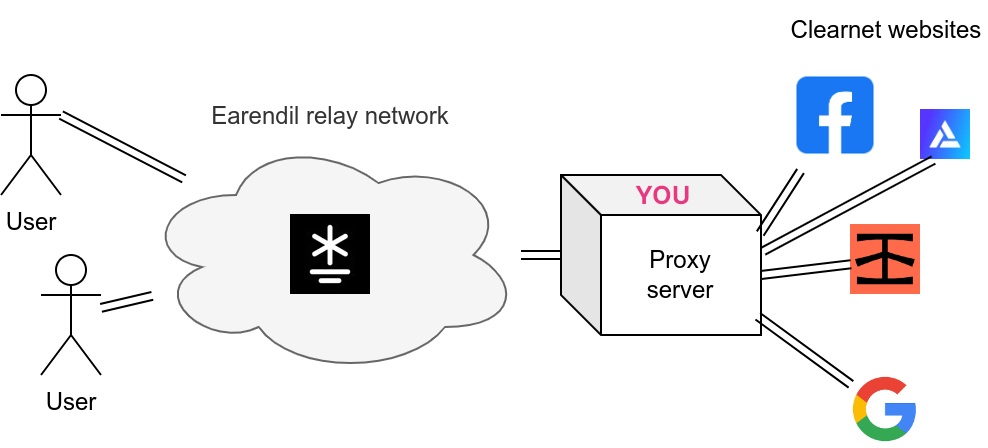

# 运行网页代理

Earendil 客户端和中继节点均可运营网页代理。当您托管一个 Earendil 网页代理时，您选择分享代理信息的客户端可以使用您的节点作为出口节点匿名浏览明网流量。



要托管网页代理，请将此配置文件粘贴到您的 Earendil 图形界面的 "Settings" 标签中：

```yaml
out_routes:
  example-relay-free:
    connect: 62.210.93.59:12345
    fingerprint: 4b7a641b77c2d6ceb8b3fecec2b2978dfe81ae045ed9a25ed78b828009c4967a
    obfs:
      sosistab3: "randomly-generated-cookie-lala-doodoo"
    price_config:
      inbound_price: 0
      inbound_debt_limit: 0
      outbound_max_price: 0
      outbound_min_debt_limit: 0

exit_config: # 您希望成为出口节点
  allowed_ports: # 您的出口节点将允许的目标端口；如果只允许通过您的代理浏览 http 和 https 网站，只需在此处放置 80 和 443
    - 80
    - 443
```

请注意，托管网页代理必然会暴露您的 IP 地址：客户总是可以连接到您的代理并访问 IP 检查网站。

启动 Earendil。现在客户端将能够自动使用您的节点作为他们的网页代理！
